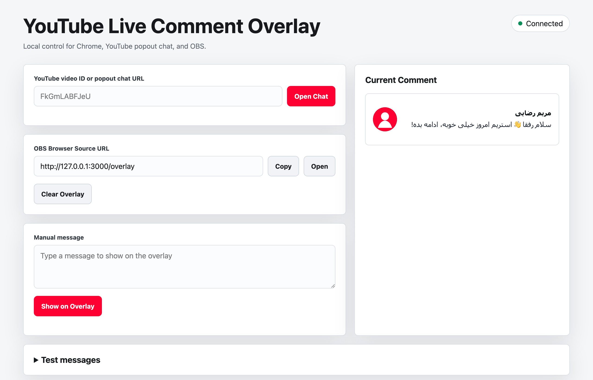
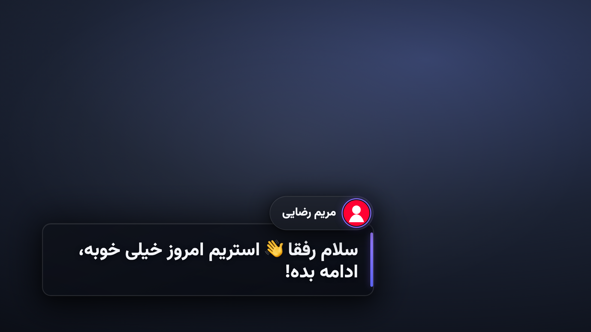

# YouTube Live Comment Overlay

Local StreamYard-style comment picker for YouTube Live and OBS.

## What is this?

A localhost tool for streamers: pick a message from YouTube Live chat and display it as a lower-third card in an OBS browser source. Everything runs on the local machine for a single user — there is no auth, no persistence, and no multi-user concern by design.

## How it works

Four processes cooperate, and they only ever talk over `http://127.0.0.1:3000`. Nothing leaves the machine.

1. **Chrome extension** (`extension/`, MV3) is injected into `studio.youtube.com/live_chat*`. It adds a **Show** button to every chat row plus a floating **Clear** button, then `POST`s the selected comment to the local server. It never talks to the overlay directly.
2. **HTTP server** (`src/server.js`) is a single `http.createServer` with a hand-rolled router. It holds exactly one `currentComment` in memory — the last one shown. It sanitizes and stores incoming comments and broadcasts every change.
3. **WebSocketHub** (`src/websocket-hub.js`) is a from-scratch WebSocket server attached to the HTTP server's `upgrade` event on `/ws`. Every show/clear is pushed to all connected clients; new clients get the current comment on connect.
4. **Overlay page** (`public/overlay.html`) is the OBS browser source; it connects to `/ws` and cross-fades between comments. The **control page** (`public/index.html`) is the operator dashboard: live preview, Clear button, a manual-message box, and a "Test messages" fixture panel.

## Screenshots

### Operator dashboard (control page)

Open `http://127.0.0.1:3000/` to point at the YouTube popout chat, copy the OBS Browser Source URL, type manual messages, and preview the comment that's currently live.



### Overlay (OBS browser source)

`http://127.0.0.1:3000/overlay` renders the selected comment as an animated lower-third card — an identity pill (avatar + name) above a message panel with an accent spine. The dark background here is only a placeholder to show contrast; in OBS the overlay is transparent and composites straight over your live video.



## Run

```sh
npm run dev
```

Open `http://127.0.0.1:3000/`. The console prints the control and overlay URLs.

## Chrome Extension

1. Open `chrome://extensions`.
2. Enable Developer Mode.
3. Load unpacked extension from this repo's `extension/` folder.
4. Open a YouTube Studio popout chat URL from the control page.

The extension only matches `https://studio.youtube.com/live_chat*` and posts selected plain-text comments to `http://127.0.0.1:3000`.

## OBS

Add a Browser Source:

- URL: `http://127.0.0.1:3000/overlay`
- Width: `1920`
- Height: `1080`
- Background: transparent

Click `Show` on a regular YouTube text chat row to display it. Click another `Show` to replace it, or `Clear` to fade it out.

## Manual Messages

The control page has a "Manual message" box: type any text and click `Show on Overlay`. Manual messages render on the overlay without the avatar/username pill — message text only.

## Test Messages

Expand the "Test messages" panel on the control page (`http://127.0.0.1:3000/`) to test extraction, injected buttons, dynamic rows, RTL/LTR text, emoji, long messages, and missing avatars without going live.

## Testing

```sh
npm test                                 # run every test/*.test.js
node --test test/server.test.js          # run a single test file
node --test --test-name-pattern="clear"  # run tests whose name matches
```
